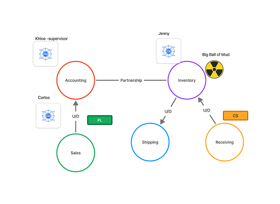

# Agentic Dapr Demo Application
A demo application employing domain driven design, Dapr (Distributed Application Runtime) and an Agentic architecture with microagents. The system will use Dapr Workflows as the orchestrator in the agentic patterns. Each microagent will have semantic memory, plugins, planners, personas (Khloe, Jenny and Carlos) and memories. The microagents will assist the human chat by responding to prompts with both user and system prompts. The microagents will be feature extensions of microservices with in a bounded context. The bounded context will set the boundaries of the microagents funtionality. 

## Knowledge References:
- Domain Driven Design
- Distributed Aplication Runtime (Dapr)
- Agentic Architecture and related patterns
- Semantic Kernel
- Andrew Ng - Agentic Design Patterns
    - Reflection pattern
    - Tools pattern
    - Planner pattern
    - Multi Agent pattern

## Intro:
In order for microagents of an agentic architecture to work in context they should follow domain driven design principals.
They should follow all the domain contextual relationships and live within the boundaries of their respective bounded context. 

The following diagram is our demos basic domain with its various bounded context. We will keep it simple with only 3 contexts and a basic ubiquitous language.

  1. Accounting
  2. Inventory
  3. Sales

In agentic AI architectures an orchestrator is needed utilizing a saga or orchestrator design pattern. (verus choreopgrapher however both should be considered)
The orchestrator is the central manager of the agentic chat and coordinates messaging between microagents. A microagent follows the microservices pattern of a ganular application that centers around a specific domain model.

More can be elaborated on best practices design for microagents but its recommended that a vertical slice architecture as used inmicroservices will suffice for now. A microagent could be a feature onto a microservice as well in order not to over ganularize domain expertise and functionality.
